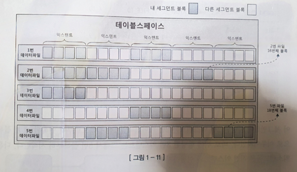

#  1.1 SQL 파싱과 최적화

## 1.1.1 구조적, 집합적, 선언적 질의 언어

 - SQL(Structured Query Language)
    - 구조적 질의 언어
    - 구조적(structued)이고 집합적(set-based)이고 선언적(declarative) 인 질의 언어
    - 결과 집합은 구조적, 집합적이지만 만드는 과정은 절차적(procedural)이어야 한다.
 - 옵티마이저
 - 프로시저를 만들어 내는 DBMS 내부엔진이 바로 SQL 옵티마이저이다.
 - 옵티마이저가 프로그래밍을 대신해 주는 셈이다.

## 1.1.2 SQL 최적화

### SQL 최적화 과정
    1. SQL 파싱
        - 파싱트리 생성(SQL 개별 요소를 파싱트리로 생성) -> Syntax 체크(문법적 오류, 순서 , 키워드 등 체크 ) -> Semantic 체크(존재하지 않는 테이블, 컬럼, 권한 체크)
    2. SQL 최적화
        - SQL 옵티마이저가 미리 수지한 시스템, 오브젝트 통계정보를 바탕으로 다양한 실행경로 생성 비교후 하나 선택
    3. 로우 소스 생성
        - SQL 옵티마이저가 선택한 실행경로를 실제 싱행 가능한 코드 또는 프로시저 형태로 포맷팅

## 1.1.3 SQL 옵티마이저
    - SQL 옵티마이저 : 사용자가 운하는 작업을 가장 효율적으로 수행할 수 있는 최적의 데이터 액세스 경로를 선택해 주는 DBMS 의 핵심 엔진.
    - 실행계획을 찾는다 -> 데이터 딕셔너리의 통계정보를 바탕으로 각 실행계획의 예상비용 산정 -> 최저비용의 실행계획 선택

## 1.1.4 실행계획과 비용
    - 실행계획 : SQL 옵티마이저가 생성한 처리절차를 사용자가 확인할 수 있게 트리구조로 표현한것이 실행계획

## 1.1.5 옵티마이저 힌트
    - 옵티마이저 힌트 : 데이터 액세스 경로를 바꿀 수 있다.(옵티마이저가 선택한 실행계획이 아닌 직접 경로 선택)

# 1.2 SQL 공유 및 재사용

## 1.2.1 소프트 파싱 vs 하드 파싱
    - 라이브러리 캐시(Library Cache)
        - SQL 파싱, 최적화 , 로우 소스 생성 과정을 거쳐 생성한 내부 프로시저를 반복 재사용할 수 있도록 캐싱해 두는 메모리 공간
        - SGA(System Global Area) 구성요소
    - SGA(System Global Area)
        - 서버 프로세스와 백그라운드 프로세스가 공통으로 액세스하는 데이터와 제어 구조를 캐싱하는 메모리 공간
    - 소프트 파싱(soft parsing)
        - SQL 을 캐시에서 찾아 곧바로 실행단계로 넘어가는 것
    - 하드 파싱(hard parsing)
        - SQL을 캐시에서 찾지 못하여 최적화 및 로우 소스 생성 단계를 모두 거치는 것
        
    - 왜 SQL 최적화 과정을 hard 라고 표현하는가?
        - 최적화 시 고려해야할 부분이 굉장히 많다.
        - 조인순서만 120(5!)이다
        - full scan 할지 index scan 할지 , index scan도 종류가 굉장히 많다
        - 그 외에도 테이블 , 컬럼, 인덱스 구조에 관한 기본정보
        - 오브젝트 통계(테이블 , 인덱스 ,컬럼 통계)
        - 시스템 통계(CPU속도, Single Block I/O 속도, multiblock I/O 속도 등)
        - 옵티마이저 관련 파라미터
    - 데이터 베이스 처리 과정은 대부분 I/O 작업에 집중
    - 하드 파싱은 CPU 를 많이 소비하는 작업
    - 따라서 hard 과정을 거쳐 생성한 내부 프로시저를 한번만 하고 버리면 낭비이므로 라이브러리 캐시 필요

## 1.2.2 바인드 변수의 중요성

### SQL 은 이름이 없다
    - SQL 전체 텍스트와 1:1 대응 관계
    - 작은 부분이라도 수정되면 다른 객체로 수정
    - SQL 이 많아지면 저장공간도 많고 찾는 속도 느리므로 영구 저장하지 않는다(Oracle)

### 공유 가능 SQL
    - 실행 시 각각 최적화를 진행하고 라이브러리 캐시에서 별도 공간 활용

    SELECT * FROM CUSTOMER WHERE LOGIN_ID = '"+login_id+"'"
    --------------------------------------------------------
    SELECT * FROM CUSTOMER WHERE LOGIN_ID = 'oraking';
    SELECT * FROM CUSTOMER WHERE LOGIN_ID = 'javaking';

    - 로그인 할 때마다 하나씩 프로시저를 거처 캐시 저장

    SELECT * FROM CUSTOMER WHERE LOGIN_ID = ?

    - 바인드 변수를 통해 SQL에 대한 하드파싱은 최초 1번만 이루어지게 해야한다.

## 1.3 데이터 저장 구조 및 I/O 메커니증

## 1.3.1 SQL이 느린 이유
    - 디스크 I/O 떄문이다.
    - 디스크 I/O 작업동안 프로세스는 대기하게 된다.
    - 따라서 I/O 가 많으면 성능 저하가 이루어진다.
    - 디스크 I/O 가 SQL 성능을 좌우한다.

## 1.3.2 데이터베이스 저장 구조
    - 블록 : 데이터를 읽고 쓰는 단위
    - 익스텐트 : 공간을 확장하는 단위, 연속된 블록 집합
    - 세그먼트 : 데이터 저장공간이 필요한 오브젝트(데이블, 인덱스, 파티션, LOB 등)
    - 데이블스페이스 : 세그먼트를 담는 콘테이너
    - 데이터파일 : 디스크 상의 물리적인 OS 파일
    - 세그먼트에 할당된 모든 익스텐트가 같은 데이터파일에 위치하지 않을 수 있다.
    - 파일 경합을 줄이기 위해 DBMS 가 데이터를 가능한 여러 데이터파일로 분산해서 저장하기 때문이다.
    - 익스텐트 내 블록은 서로 인접한 연속된 공간이지만, 익스텐트끼리는 연속된 공간이 아니다
    - DBA(Data Block Address) : 데이터 블록의 고유 주소값
    - 인텍스 ROWID 는 DBA+로우번호(블록내순번) 으로 구성
    - 테이블 스캔시 테이블 세그먼트 헤더에 저장된 익스텐트 맵을 통해 각 익스텐트의 첫번째 블록 DBA 를 알 수 있다. 그 후 연속적 스캔을 진행
    
    

## 1.3.3 블록 단위 I/O

     - 블록 : DBMS 가 데이터를 읽는 단위
     - 특정 레코드 1개를 읽고 싶어도 블록을 통째로 읽는다.
     - 오라클은 기본 8KB 크기 블록 사용(1Byte 읽기 위해 8KB 읽음)
        - **인덱스도 블록 단위로 데이터를 읽는다.**

## 1.3.4 시퀀셜 액세스 vs 랜덤 액세스
    - 시퀀셜액세스 : 논리적, 물리적으로 연결된 순서에 따라 차례대로 불록을 읽는 방식
        - 예) 인덱스 리프 블록을 논리적으로 읽는 것
    
    - 테이블 블록간에는 서로 논리적인 열결고리가 없지않아?
    - 세그먼튼에 할당된 익스텐트 목록을 세그먼트 헤더에 맵으로 관리, 익스텐트 맵은 각 익스텐트의 첫번째 블록 주소값을 가진다. 이를 통해 연속적으로 블록을 읽으면 Full Table Scan 이다.

    - 랜덤(Random) 액세스 : 논리적, 물리적 순서를 다르지 않고 레코드 하나를 읽기 위해 한 블록씩 접근

## 1.3.5 논리적 I/O vs 물리적 I/O

## DB 버퍼캐시

    - 자주 읽는 블록을 매번 디스크에서 읽는 것은 비효율적이다.
    - SGA 구성요소로 DB 버퍼캐시가 있다
        - 라이브러리 캐시(코드 캐시) : SQL과 실행계획, DB 저장형 항수/프로시저 등을 캐시
        - DB 버퍼 캐시(데이터 캐시) : 디스크에서 어렵게 읽은 데이터 블록을 캐싱하여 같은 블록에 대한 반복적인 I/O Call 줄인다.
    - 데이터 블록을 읽을 때 항상 버퍼캐시터 탐색
    - 공유메모리 영역이므로 같은 블록을 읽는 다른 프로세스도 득을 본다.

## 논리적 블록 I/O vs 물리적 I/O
    - 논리적 블록 I/O
        
        - SQL 처리하는 과정에 발생한 총 블록 I/O 
        - 메모리상의 버퍼캐시를 경유하므로 메모리 I/O(전기적 신호) 와 동일

    - 물리적 블록 I/O

        - 디스크에서 발생한 총 블록 I/O
        - 블록캐시에서 찾지 못한 경우 디스크 액세스하므로 논리적블록 I/O 중 일부를 물리적으로 I/O 한다.
        - 디스크 I/O는 물리적 작용이 일어나므로 굉장히 느리다.
## 버퍼캐시 히트율(Buffer Cache Hit Ratio, BCHR)

    BCHR = (캐시에서 곧바로 찾은 블록 수 / 총 읽은 블록 수) 100
    BCHR = (1 - (물리적 I/O) / (논리적 I/O)) 100

    - 평균 99%를 달성해야 한다.
    - 실제 SQL 성능 향상을 위해서는 믈리적 I/O가 아닌 논리적 I/O를 줄여야 한다.

    물리적 IO = 논리적 I/O * (100 - BCHR)

    - 논리적 I/O 는 일정하므로 물리적 I/O 는 BCHR 에 의해 결정된다.
    - BCHR 은 시스템 환경에 따라 달라진다.
    - 물리적 I/O 는 결국 통제 불가능한 외생변수에 의해 발생한다.
    - SQL 성능은 결국 논리적 I/O 를 줄이는 것이다.
    - **논리적 I/O를 줄임으로 써 물리적 I/O 를 줄이는 것이 곧 SQL 튜닝이다**

## 1.3.6 Single Bolck I/O vs Multiblock I/O

    - Single Block I/O
        - 한번에 한 블록씩 요청하여 메모리 적재
        - 인덱스는 기본적으로 single 방식
        - 인덱스는 소량 데이터를 읽을 때 주로 사용
    - Multiblock I/O
        - 한번에 여러 블록씩 요청하여 메모리 적재
        - 많은 데이터를 읽을 때
        - 테이블 전체 스캔시 사용
        - 단위가 크면 더 효율적이다(한번 I/O 작업으로 프로세스 쉴때 많이가져온다)
        - 대용량 테이블 full scan 시 multiblock 단위를 크게 설정하면 성능이 좋다.
        - os 단에서는 보통 1MB 단위로 I/O 수행한다
            -(8KB*128 = 1MB) 오라클에서는 I/O 단위가 8KB 이므로 한번에 128을 가져오는게 최대이다
        - 하지만 익스텐트 결계를 넘지는 못한다.

## 1.3.7 Table Full Scan vs Index Range Scan
    - Table Full Scan
        - 테이블에 속한 블록 전체를 읽는다
    - Index Range Scan
        - 인덱스에서 일정량을 스캔하면서 얻는 ROWID(테이블 레코드가 디스크상 어디 저장되었는지) 로 테이블 레코드를 찾는다.
    - Table Full Scan 은 Multiblock I/O 이므로 대용량의 경우 index가 아닌 full scan을 하는게 효과적이다.
    - 또한 인덱스는 블록을 반복적으로 읽으므로 비효율적일수도있다.

## 1.3.8 캐시 탐색 메커니즘

    - Direct Path I/O 를 제외한 모든 블록 I/O 는 메모리 버퍼캐시를 경유한다.
    - 버퍼캐시는 해시 구조로 관리된다.
    - 해시 알고리즘으로 버퍼 헤더를 찾고, 얻은 포인터로 버퍼 블록을 액세스한다.

## 메모리 공유자원에 대힌 액셋그 직렬화
    - 버퍼캐시는 SGA 구성요소로 공유자원이다.
    - 동시성의 문제가 존재한다.
    - 한 프로세스씩 순차적 접근이 가능하도록 직렬화 메커니즘이 필요하다

## 래치(Latch)

버퍼 캐시에서 해시 체인을 탐색하면서 대향의 데이터를 읽는데 , 그사이에 체인이 수정되면 안된다. 따라서 해시체인 래치가 존재하고 키를 획득한 프로세스만이 진입가능하다.
    - SGA를 구성하는 서브 캐시마다 별도의 래치 존재
    - 래치에 의한 경합이 높으면 성능 저하 발생
    - 버퍼블록에도 직렬화 메커니즘이 존재한다 : 버퍼 Lock
    - 결국 SQL 튜닝을 통해 쿼리 일량(논리적I/O)를 줄여햐 한다.

