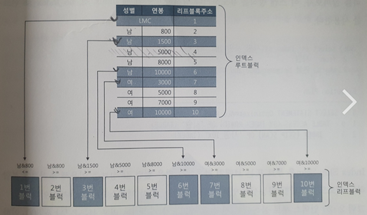

## 2.1 인덱스 구조 및 탐색
    - 인덱스 : 온라인 트랜잭션 처리 (Online Transaction Processing) 시스템에서는 소량 데이터를 주로 검색하므로 인덱스 튜닝이 중요하다.

## 인덱스 튜닝의 2 가지 핵심요소

    1. 인덱스 스캔 효율과 튜닝

    - 인덱스 스캔 과정에서 발생하는 비효율을 줄이는 것
    - 예) 어떤 컬럼을 인덱스로 활용해야 스캔량이 줄어들까?

    2. 랜덤 액세스 최소화 튜닝

    - 테이블 액세스 횟수를 줄이는 것
    - 1번보다 2번이 성능에 미치는 영향이 더크므로 중요하다.
    - **즉 SQL 튜닝은 랜덤 I/O 와의 전쟁이다.**

## 2.1.2 인덱스 구조

    - 루트 , 브랜치 블록에 있는 각 레코드는 하위 블록에 대한 주소값을 가진다.
    - LMC(Leftmodst Child) : 자식 노드 중 가장 왼쪽 끝에 위치한 블록을 가리킨다.
    - 리프 블록에 저장된 각 레코드는 키값 순으로 정렬되어 있고, 테이블 레코드를 가리키는 주소값, 즉 ROWID 를 갖는다.
    - 인덱스 키값이 같으면 ROWID 순으로 정렬된다.
        - ROWID = 데이터 블록 주소 + 로우 번호
        - 데이터 블록 주소 = 데이터 파일번호 + 블록 번호
        - 블록 번호 : 데이터 파일 내에서 부여한 상대적 순번
        - 로우 번호 : 블록 내 순번
    - 인덱스 과정은 수직적 탐색과 수평적 탐색으로 나뉜다.
        - 수직적 탐색 : 인덱스 스캔 시작지점을 찾는 과정
        - 수평적 탐색 : 데이터를 찾는 과정

## 2.1.3 인덱스 수직적 탐색

수직적 탐색 : 조건을 만족하는 첫번째 레코드를 찾는 과정(=인덱스 스캔 시작지점을 찾는 과정)

    수직적 탐색은 '조건을 만족하는 레코드'를 찾는 과정이 아니라 '조건을 만족하는 첫번째 레코드'를 찾는 과정임을 받드시 기억하자!

## 2.1.4 인덱스 수평적 탐색

수평적 탐색 : 찾고자 하는 데이터가 더 안 나타날때까지 인덱스 리프 블록을 수평적으로 스캔한다.
    
    - 양방향 연결 리스트 구조이므로 좌 -> 우  우 -> 좌 수평적 탐색이 가능하다
    - 인덱스 수평적 탐색의 이유
        -   1. 조건절을 만족하는 데이터를 모두 찾기 위해서
        -   2. ROWID 를 얻기 위해서
                (인덱스만 스캔하고 끝나는 경우도 있지만, 일반적으로 인덱스를 스캔하고서 테이블로 액세스한다. 이때 ROWID가 필요하다)

## 2.1.5 결합 인덱스 구조와 탐색    

create index 고객_N1
on 고객(성별, 고객병);

select * from 고객
where 성별 = '남'
and 고객명 = '이재희'

- 수직적 탐색을 거처 찾은 인덱스 스캔 시작점은 성별='남'인 첫번째 레고드가 아닌 성별='남'이면서 고객명'이재희'인 레코드이다
- 인덱스 선두 컬럼을 모두 "=" 조건으로 검색할 때는 어느 컬럼을 인덱스 앞쪽에 두든 블록 I/O 개수가 같으므로 성능도 같다.

Balanced 의 의미 : B+ Tree 의 B 는 Balanced 의 약자이다. Balanced 는 어떤 값으로 탐색하더라도 인덱스 루트에서 리프 블록에 도달하기까지 읽는 블록 수가 같음을 의미한다. 따라서 루트로부터 모든 리프 블록까지의 높이(height) 는 항상 같다

## 2.2 인덱스 기본 사용법

    - 인덱스 컬럼(정확히 말하며, 선두 컬럼)을 가공하지 않아야 인덱스를 정상적으로 사용할 수 있다.
    - 인덱스를 정상적으로 사용한다는 의미는 Index Range Scan 을 의미한다.
    - 인덱스 컬럼을 가공해도 인덱스을 사용할 수 있지만 , 스캔 시작점을 찾을 수없고 멈출 수 없어 리프 블록 전체를 스캔하는 Index Full Scan 방식으로 작동된다.

## 2.2.2 인덱스를 Range Scan 할 수 없는 이유
    - 인덱스 스캔 시작점을 찾을 수 없기 때문이다.
    - 일정 범위를 스캔하려면 시작지점과 끝지점이 있어야 한다.

select substr(생년월일, 5, 2) = '0.5'
-- 시작지점을 찾을 수 없다.

where nvl(주문수량, 0) < 100
-- 값이 null 면 0 으로 치환한 값은 시작지점을 찾을 수없다.

where 업체명 like '%대한%'
-- '대한'으로 시작하는 값은 특정 구간에 모여있어 range scan 이 가능하지만
-- '대한'을 포함하는 값은 전체 구간에 걸쳐 흩어져 있어 range scan 불가

where (전화번호 = :tel_no OR 고객명 = :cust_nm)
-- OR족건 또한 어느 한 시작시점을 바로 찾을 수 없다.

OR Expansion
다음과 같이 쿼리하면 고객명 전화번호 인덱스 각각에 대해 Index Range Scan 이 가능하다

select * 
from 고객
where 고객명 = :cust_nm
union all
select * 
from 고객
where 전화번호 = :tel_no
and (고객명 <> :cust_nm or 고객명 is null)
OR 조건식을 SQL 옵티마이저가 위와 같은 형태로 변환하는데 이를 Or Expansion 이라 한다. 오라클에서 use_concat 힌트로 유도가능

IN 조건은 OR 조건을 표현하는 다른 방식이다. UNION ALL 방식으로 작성시 Range Scan 가능하다.
IN 조건은 SQL 옵티마이저가 IN-List Iterator 방식을 사용한다
List 개수만큼 Index Range Scan 반복 = UNION ALL 방식과 동일 효과

## 2.2.4 인덱스를 이용한 소트 연산 생략

    - 인덱스는 정렬되어 있다
    - 따라서 소트연산 생략 효과도 부수적으로 얻게 된다.
    - 인덱스 활용시 이미 정렬되어 있으므로 ORDER BY 가 있어도 정렬 연산을 따로 사용하지 않는다(실행계획확인가능)
    - 만약 정렬 연산을 생략할 수 있게 인덱스가 구성되어 있지 않으면, SORT ORDER BY 연산 단계가 추가된다.
    - 내림차순(Desc) 정렬에도 인덱스 활용 가능하다
    - 오름차순(Asc) 정렬 시 조건 만족하는 가장 작은 값을 찾아 좌측에서 수직적 탐색한후 우측으로 수평적으로 탐색을 한다.
    - 내림차순(Desc) 정렬 시 조건 만족하는 가장 큰 값을 찾아 우측으로 수직적 탐색한 후 좌측으로 수평적 탐색을 한다.

## 2.2.5 Order BY 절에서 컬럼 가공

    - 인덱스 컬럼을 가공하면 정렬 효과를 누릴 수 없다.
    - ORDER BY 를 가공한 값으로 정렬해 달라고 해도 정렬효과를 누릴 수  없다.

SELECT *
FROM A
WHERE B='c'
ORDER BY D || E --||:컬럼 합치기

## 2.2.6 SELECT-LIST 에서 컬럼 가공
    - 인덱스 활용 시 MIN MAX 를 찾는 속도가 굉장히 빠르다
        - MIN : 리프블록의 왼쪽에서 레코드 1개만 읽고 멈춘다
        - MAX : 리프블록의 오른쪽에서 레코드 하나만 읽고 멈춘다.

## 2.2.7 자동 형변환
    - 데이터 타입이 서로 다른 경우 컴파일 시점에 에러를 내거나 자동으로 형변환을 해준다(DB 마다 다르다)
    - 오라클의 경우 자동으로 형변환을 해주고 컬럼이 변경되어 Index range scan 이 아닌 table full scan 이 발생할 수 있다.
     - 저자는 가능하면 자동형변환 기능에 의존하지 않고 인덱스 컬럼 기준으로 반대편 컬럼 또는 값을 정확히 형변환 하는 것을 추천한다.
    - 간혹 형변환 함수의 연산 횟수 증가로 인한 성능 저하를 우려하지만 SQL 성능은 블록 I/O 를 줄이는 것이 최우선적이다.
    - 또한 형변환 함수를 생략해도 옵티마이저가 자동으로 생성하기 때문에 차이가 없다.

## 2.3 인덱스 확장기능

## 2.3.1 Index Range scan
    - Index Range Scan 은 B*Tree 인덱스의 가장 일반적인 형태의 방식
    - 수직적 탐색 + 수평적탐색(필요한 범위만)
    - 선두 칼럼을 가공하지 않은 상태로 조건절에 사용해야 합니다 -> 조건 만족시 무조건 Range Scan 가능

## 2.3.2 Index Full Scan
    - 수직적 탐색 없이 인덱스 리프 블록을 처음부터 끝까지 수평적으로 탐색하는 방식
    - 최적의 인덱스가 없을때 차선을 선택된다.

    create index emp_ename_sal_idx on emp (ename, sal);

    select * from emp
    where sal > 2000
    order by ename;

    - 선두 컬럼인 ename 이 조건절에 없으므로 Range Scan 불가능
    - SAL 컬럼이 인덱스에 있으므로 Index Full Scan 활용

    **Index Full Scan VS Table Full Scan**

    - 선두 컬럼이 조건절에 없으면 Table Full Scan 을 먼저 고려 한다.
    - 인덱스가 차지하는 면적은 테이블보다 훨씬 적다. 이런 경우 테이블 전체보다는 인덱스 전체를 스캔하는 것이 더 효율적일 수 있다.
    - 이런 경우 옵티마이저가 Index Full Scan 방식을 선택합니다.
    - 스캔 데이터가 자체가 많은 경우에는 Single block 전략인 Index 보다는 Multi Block 전략인 Table Full Scan 으로 힌트 설정을 하는 것이 더 효과적일 수 있습니다.
    - Index Full Scan 의 경우 Order By 효과를 가지므로 해당 연산을 생략할 목적으로 사용되기도 합니다.

    select /*+ first_rows */ *
    from emp
    where sal > 1000
    order by ename;

    -- 실제 order by 가 아닌 INDEX(FULL SCAN) 이 사용
    -- first_rows 힌트로 옵티마이저 모드를 변경
    -- 소트 연산을 생략함으로써 전체 집합 중 처음 일부를 빠르게 출력할 목적으로 옵티마이저가 Index Full Scan 방식을 선택(부분범위 처리가 가능한 상황에서 극적인 성능 개선 효과를 가진다)
    -- 하지만 first rows 는 더 많은 I/O 를 발생시킬 수 있으므로 주의요먕

## 2.3.3 Index Unique Scan

    - 수직적 탐색으로만 데이터를 스캔하는 방식
    - 인덱스를 "=" 조건으로 탐색하는 경우 작동
    - 해당 인덱스의 키 컬럼을 모두 "=" 조건으로 검색 시 데이터를 한 건 찾는 순간 더 이상 탐색할 필요가 없습니다.
    - 복합키도 가능

## 2.3.4 Index Skip Scan

    - 오라클은 9i 버전 부터 인덱스 선두 컬럼이 조건절에 없어도 Table Full Sacn 이 아닌 인덱스를 활용하는 새로운 스캔 방식인 Index Skip Scan을 도입하였습니다.
    - 조건절에 빠진 인덱스의 선두 컬럼의 Distinct Value 개수가 적고 후행 컬럼의 Distinct Value 개수가 많을 때 유용합니다.
    - 인덱스 선두 컬럼이 존재할 때 유용한 경우도 존재하고 다양한 케이스에서 효율적인 경우들이 존재합니다.
    - Index Range Scan 이 불가능하거나 효율적이지 못한 상황에서 Index Skip Scan이 효과를 발휘하는 경우가 종종 있습니다

    select * from 사원 where 성별 = '남' and 연봉 between 2000 and 4000

## 2.3.5 Index Fast Full Scan

    - Index Full Scan 보다 빠른 방식입니다.
    - 논리적인 인덱스 트리 구조를 무시하고 인덱스 세그먼트 전체를 Multiblock I/O 방식으로 스캔합니다.

    - Index Full Scan
    루트 -> 브랜치1 -> 1,2,3,4,5,6,7,8,9,10 순서로 진행

    - Index Fast Scan
    1,2,10,3,9,8,7,4,5,6(연결리스트를 무시한채 익스텐트에서 순서대로 읽는다)

    - Index Fast Full Scan 은 Multiblock I/O 방식을 사용하므로 대량의 인덱스 블록을 읽을때 효과를 발휘한다.
    - 속도가 빠르지만 연결리스트 구조를 무시하므로 정렬이 되지 않는다
    - 쿼리에 사용한 컬럼이 모두 인덱스에 포함돼있을 떄만 사용할 수 있다.
    - 인덱스가 파티션 되어 있지 않더라도 병렬 쿼리가 가능하다

## 2.3.6 Index Range Scan Descending

    - Index Range Scan 과 기본적으로 동일한 방식이다.
    - 인덱스를 뒤에서부터 앞쪽으로 스캔하기 때문에 내림차순으로 정렬된 결과집합을 더는다.

