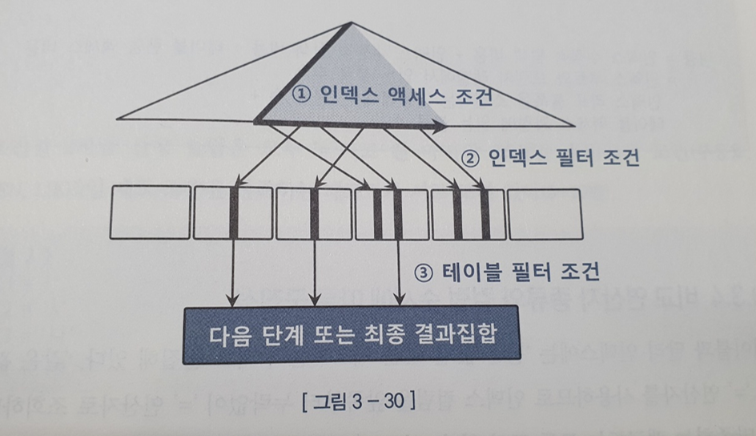

# 인덱스 튜닝

## 3.1 테이블 액세스 최소화

    - SQL 튜닝은 랜덤 I/O 와의 전쟁이다.
    
## 3.1.1 테이블 랜덤 액세스

## 인덱스 ROWID 는 논리적 주소

    - 인덱스를 스캔한 후 반드시 테이블을 액세스합니다.
    - 인덱스 ROW ID 는 논리적 주소로 테이블 레코드를 찾아가기위한 주소 정보를 가진다

## 메인 메모리 DB 와 비교

    - 잘 튜닝된 OLTP 성 DB 는 버퍼 캐시 히트율이 99% 이상입니다.
    - 그렇다면 디스크 DB 는 메인 메모리 DB(디스크 상의 주소정보가 아닌 메모리상의 주소정보(Pointer) 를 가져 엄청나게 빠르다 ) 와 비교했을때 성능이 비슷할 거 같지만 실제 성능이 좋지 않으며 대량 인덱스 액세스 시 엄청난 차이를 보입니다.
    - 오라클은 테이블 블록이 수시로 버퍼 캐시에서 밀려났다가 다시 캐싱됩니다. 따라서 직접적인 포인터 연결이 불가능합니다.
    - 디스크 주소 정보를 이용해 해시 알고리즘으로 버퍼 블록을 찾아갑니다.

## I/O 메커니즘 복습

    - 블록을 읽을 때 디스크로 가지 않고 버퍼 캐시를 활용합니다.
    - DBA를 통해 해시 함수에 입력해서 해시 체인을 찾고 버퍼 헤더를 찾습니다.
    - 해싱 알고리즘으로 버퍼 헤더를 찾고, 거기서 얻은 포인터로 버퍼 블록을 찾습니다.
    - 데이터를 버퍼캐시에서 먼저 찾고 없을때만 디스크에서 블록을 읽습니다.
    - 모든 데이터가 캐싱되어도 매번 DBA 해싱과 래치 획득 과정을 거쳐야 되고 lock까지 고려한다면 인덱스 ROWID 를 이용한 테이블 액세스는 고비용 구조입니다.

## 3.1.2 인덱스 클러스터링 팩터

    - 클러스터링 팩터(Clustering Factor, CF) : 특정 컬럼을 기준으로 같은 값을 갖는 데이터가 서로 모여 있는 정도
    - CF 가 좋은 컬럼에 생성한 인덱스는 검색 효율이 매우 좋습니다.
    - 물리적으로 모여있을때 조회 속도가 빠릅니다.

## 왜 CF 가 좋은 컬럼에 생성한 인덱스는 검색 효율이 좋은가?

    - 오라클은 래치 획득과 해시 체인 스캔 과정을 거처 테이블 블록에 대한 포인터를 바로 해제하지 않고 유지 합니다(버퍼 Pinning)
    - 이를 통해 논리적 블록 I/O 과정을 생략할 수 있습니다.
    - CF가 안좋은 경우 테이블 액세스 하는 횟수만큼 블록 I/O 가 발생합니다.

## 3.1.3 인덱스 손익분기점

    - 인덱스 ROWID 를 이용한 테이블 액세스는 고비용 구조입니다.
    - Index Range Scan이 Table Full Scan 보다 느려지는 지점을 인덱스 손익분기점이라고 부릅니다
        - Table Full Scan은 시퀀셜 액세스인 반면 , 인덱스 ROWID 를 이용한 테이블 액세스는 랜덤 액세스 방식입니다.
        - Table Full Scan 은 Multiblock I/O 인 반면, 인덱스 ROWID 를 이용한 테이블 액세스는 Single Block I/O 방식입니다.
    - CF가 나쁘면 논리적 I/O 가 늘어 물리적 I/O 도 증가합니다

## 온라인 프로그램 튜닝 VS 배치 프로그램 튜닝

    - 대량의 데이터를 읽고 갱신하는 배치(Batch) 프로그램은 항상 전체범위 처리 기준으로 튜닝해야 합니다.
    - 일부가 아닌 전체를 빠르게 처리하는 것을 목표로 삼아야 합니다.
    - 이때 인덱스와 NL 조인보다 Full Scan 과 해시 조인이 유리합니다.
    - 하지만 초대용량 테이블은 Full Scan 이 부담스러울 수 있습니다.
    - 이런 경우 파티션 활용 전략과 병령 처리가 중요합니다.
    - 자주 구분되는 컬럼을 기준을 파티션을 분리하면 효과적입니다.
    - 파티션 테이블에도 인덱스를 사용할 수 있지만 , Full Scan 이 대부분 효과적입니다. 왜냐하면 파티셔닝 이유 자체가 대부분 Full Scan 을 빠르게 하기 위하여서 입니다.

    인덱스는 다양한 튜닝 도구중 하나이다. 큰 테이블에서 아주 적은 일부 데이터를 빨리 찾으려 할 때 주로 사용된다.

## 3.1.4 인덱스 컬럼 추가
    
    - 테이블 액세스 최소화를 위해 사용되는 가장 일반적인 튜닝 기번은 인덱스에 컬럼을 추가하는 것이다.
    - 기존 인덱스 가 A+B 인 경우 B+A 로 바꾸면 좋지만 실 운영 환경에서 변경은 쉽지 않다
    - 그렇다고 모든 인덱스를 추가하다보면 관리 비용과 DML 부하에 따른 트랜잭션 선능 저하가 발생할 수 있다.
    - 기존 인덱스에 컬럼을 추가하는 것으로 효과를 볼 수 있ㄷ.
        -인덱스 스캔량은 줄지 않지만 테이블 랜덤 액세스 횟수를 줄여준다.

## 3.1.5 인덱스만 읽고 처리

    - 테이블 랜덤 액세스가 아무리 많아도 필터 조건에 의해 버려지는 레코드가 없다면 비효율은 없습니다.
    - 비효율이 없더라고 인덱스 스캔 과정에서 얻은 데이터가 많다면 그만큼 테이블 랜덤 액세스가 많이 발생하여 성능이 느립니다.
    - 반드시 성능을 개선해야 한다면 쿼리에 사용된 컬럼을 모두 인덱스에 추가해서 테이블 액세스가 아예 발생하지 않게 하는 방법을 고려 할 수 있습니다.
    - 이름 Covered 쿼리, 이 쿼리에 사용한 인덱스를 Covered 인덱스 라고 부릅니다.
    - 성능은 매우 좋지만, 추가해야 할 컬럼이 많으면 실제 적용이 어려울 수 있습니다

## Include 인덱스

    - 인덱스 키 외에 미리 지정한 커럼을 리프 레벨에 함게 저장하는 기능

    create index emp_x01 on emp (deptno) include (sal)

    - 수평적 탐색에서 include 인덱스 컬럼을 사용하여 필터 조건으로 활요할 수 있다.
    - include 를 통해 인덱스 스캔량을 줄일 수 있다.
    - 이를 통해 테이블 랜덤 액세스를 줄일 수 있다.
    - 필터 조건이므로 이를 통해 소트 연산을 생략할 수 있다

## 3.1.6 인덱스 구조 테이블

    - 랜덤 액세스가 아예 발생하지 않도록 테이블을 인덱스 구조로 생성할 수 있습니다.

    - 위 그림과 같이 인덱스 리프 블록이 곧 데이터 블록이다
    - 오라클은 IOT(Index-Organized Table) 이라 부르고 MS-SQL Server 는 클러스터형 인덱스 라고 부릅니다.
    - IOT 는 인위적으로 클러스터링 팩터를 좋게 만드는 방법입니다.

    create table ~~ organization index;
    -- organization 옵션으로 가능

## 3.1.7 클러스터 테이블

## 인덱스 클러스터 테이블

    - 클러스터 키 값이 같은 레코드를 한 블록에 모아서 저장합니다.
    - 한 블록에 모두 담을 수 없는 경우 새로운 블록을 할당해 클러스터 체인으로 연결합니다.
    - 여러 테이블 레코드를 같은 블록에 저장할 수도 있는데 이를 다중 테이블 클러스터 라고 부릅니다
        - 일반 테이블은 하나의 데이터 블록을 여러 테이블과 공유할 수 없습니다.

    create cluster c_dept# ( deptno number(2) ) index;
    create index c_dept#_idx on cluster c_dept#;

    - 클러스터에 테이블을 담기 전에 반드시 클러스터 인덱스를 정의해야 합니다.
        - 왜냐하면 클러스터 인덱스는 데이터 검색 용도 뿐 아니라 데이터 저장될 위치를 찾을 때도 사용하기 때문이다.
    - 클러스터 인덱스도 B*Tree 인덱스 구조를 띄지만 , 테이블 레코드와 1:M 관계를 가져 클러스터 인덱스의 키 값은 항상 unique 하다는 특징을 가집니다.

    - 해당 클러스터 키로 한번만 랜덤 액세스가 발생하고 그 후 에는 시퀀셜 방식으로 스캔하기 때문에 효율적입니다.
    - 실행계획을 보면 INDEX (UNIQUE SCAN) 이 발생하는 것을 볼 수 있습니다.

## 해시 클러스터 테이블

    - 해시 클러스터는 인덱스를 사용하지 않고 해시 알고리즘을 사용한다는 점만 다릅니다.

create cluster c_dept# ( deptno number(2) ) hashkeys 4;

    - 실행계획을 보면 TABLE ACCESS(HASH) 인것을 볼 수 있습니다.

## 3.2 부분범위 처리 활용

## 3.2.1 부분범위 처리

    - DBMS 가 클라이언트에게 데이터를 전송할 때 일정량씩 나누어 전송합니다.
    - 전송하지 않은 분량이 많이 남아있어도 추가 Fetch Call 을 받기 전까지 그대로 멈춰서 대기합니다.
    - order by 가 추가되면 전체 범위처리로 바뀝니다.
    - 하지만 인덱스가 적용된다면 항상 정렬상태이므로 바로 전송가능합니다.
    - 매번 보내는 양(Array Size) 는 환경에 맞추어 설정합니다.
    - 이러한 설정은 DB 가 아닌 프로그램 몫입니다.
    - 따라서 Initial Fetch 와 Array Size 를 프로그램에서 설정해주어야 합니다.

## 3.2.3 OLTP 

    - OLTP 업무에서 쿼리 결과는 많아도 사용자는 모든 데이터를 일일히 확인하지 않습니다.
    - 주로 정렬 순서에서 상위 일부 데이터만 확인합니다.
    - 정령상태를 유지하는 인덱스를 활용하면 정렬 작업을 생략하고 앞쪽 일부 데이터를 아주 빠르게 보여줄 수 있습니다.

## 멈출 수 있어야 의미있는 부분범위 처리

    - 클라이언트와 DB 서버 사이에 WAS < AP 서버 등이 존재하는 n-Tier 아키텍처에서는 클라이언트 특정 DB 커넥션을 독점할 수 없습니다.
    - 단위 작업을 마치면 DB 커넥션을 곧바로 커넥션 풀에 반환해야 합니다.
    - 그 전에 sql 조회 결과를 클라이언트에게 모두 전송하고 커서를 닫아야 합니다.

    
## 3.4 인덱스 설계

## 3.4.1 인덱스 설계가 어려운 이유

    - 인덱스가 많으면 문제가 발생합니다.
        - DML 서능 저하 ( -> TPS 저하)
        - 데이터베이스 사이즈 증가( -> 디스크 공간 낭비)
        - 데이터베이스 관리 및 운영 비용 증가
    - 데이터 입력시 모든 인덱스에 데이터를 입력해야 하고, 수직적 탐색으로 블록을 찾고 블록 공간 여유가 없으면 인덱스 분할도 발생합니다.
    - 데이터 지울때도 모든 인덱스의 레코드를 일일이 찾아야 합니다.

    운영 환경에서는 인덱스 변경이 쉽지 않습니다. 따라서 시스템 개발 단계에서 인덱스를 최적으로 설계하는 것이 매우 중요합니다.

## 3.4.2 가장 중요한 두가지 선택 기준 

    - 인덱스 선두 컬럼을 조건절에 받드시 사용하여 Index Range Scan 을 해야 합니다.
    - 결합 인덱스를 구성할 때 2가지 기준이 있습니다.
        - 1. 조건절에 항상 사용하거나 , 자주 사용하는 컬럼을 선정합니다.
        - 2. '=' 조건으로 자주 조회하는 컬럼을 앞쪽에 둔다

## 3.4.3 스캔 효율성 이외의 판단 기준

    - 위에 있는 2조건이 가장 중요하지만 그렇게 간단하게 뚝딱이 안된다. 고려해야할 부분이 많습니다.
        - 수행빈도
        - 업무상 중요도
        - 클러스터링 팩터
        - 데이터량
        - DML 부하 (= 기존 인덱스 개수, 초당 DML 발생량 , 자주 갱신하는 컬럼 포함 여부등)
        - 저장 공간
        - 인덱스 관리 비용 등

    - 다양한 판단 기준에 의해 설계자의 성향과 스타일에 따라 결과물이 달라집니다.
    - 이중 가장 중요한 하나의 **수행빈도** 라고 저자는 말합니다.
    - 자주 수행하지 않는 SQL 은 인덱스 스캔 과정에 비효율이 있어도 큰 문제가 아닐 수 있습니다.
    - 하지만 수행빈도가 높은 SQL 에는 최적의 인덱스를 구성해야 합니다.
    - NL의 경우 Outer 는 1번만 그치므로 스캔 과정의 비효율을 감수 할 수 있지만 Inner의 경우 반복적인 작업이 진행되므로 비요율이 있으면 큰 문제가 야기될 수 있습니다.
    - 따라서 수행빈도가 높은 Inner에서 인덱스 '=' 조건 컬럼을 선두에 두는 것이 중요하고, 가능하면 테이블 액세스 없이 인덱스에서 필터링을 마치도록 구성해야 합니다.
    
    - 데이터 량도 중요합니다.
    - 데이터 량이 많으면 inert도 많아집니다. 이런경우 인덱스 를 하나라도 줄이는 것이 시스템에 큰 영향을 미칩니다.

## 3.4.4 공식을 초월한 전략적 설계

    - 모든 패턴마다 인렉스를 만들 수는 없습니다.
    - 핵심적인 액세스 경로 한 두개를 전ㄹ냑적으로 선택하여 최적 인덱스를 설계하고 , 나머지 액세스 경로는 약간의 비효율이 있더라도 목표 성능을 만족하는 수준으로 인덱스를 구성할 수있어야 합니다.
    - 이에 대한 선택과 전략적 판단 근거도 가지고 있어야 합니다.

## 보험사 가계약 전략
    
    - 인덱스 스캔 효율을 위해 = 조건 컬럼을 앞에 두고 BETWEEN 조건 컬럼을 뒤에 두면 조회 방식에 모두 index 를 만들어야 합니다.
    - 일자/일시 조건을 선두에 두고, 자주 사용하는 필터 조건을 모두 뒤쪽에 추가하는 방식은 어떨까?
        - 두가지 **핵심 포인트**로 설계를 하였습니다.
        -   1. 일자 조회구간이 길지 않으면 인덱스 스캔 비효율이 성능에 미치는 영향이 크지 않습니다
        -   2. 인덱스 스캔 효율보다 테이블 액세스가 더 큰 부하요소입니다.
    - 대부분의 가계약은 3일 이내 데이터를 조회합니다. 가끔 3일을 초과하거나 한달치를 조회할 수 있지만 많지 않고, 불필요한 테이블 액세스를 발생하지 않게 하였으므로 인내할 수 있는 성능일 것입니다.
    - BETWEEN 조건 컬럼을 선두에 두는 것은 찝찝할 수 있습니다. 하지만 가계약 테이블을 다양한 패턴으로 조회하지만, 가장 많이 쓰이는(85% 이상) 패턴은 입력자 = , 데이터생성일시 BETWEEN 조건이기 때문에 상황에 맞게 설정합니다.
    - 이런식으로 인덱스 개수를 최소화하여, 사용빈도가 높거나 중요한 액세스 경로가 새로 도출될 때 최적의 인덱스를 추가할 여유가 생깁니다.

## 3.4.5 소트 연산을 생략하기 위한 컬럼 추가

    - 인덱스는 정렬을 보장하므로 ORDER BY, GROUP BY를 위한 소트 연산을 생략합니다.
    - = 조건절 컬럼은 ORDER BY 절에 없더라도 인덱스 구성에 포함할 수 있습니다.(앞 뒤 어디에 두어도 상관없습니다)
    - = 이 아닌 조건절 컬럼들은 반드시 ORDER BY 컬럼 보다 뒤쪽에 두어야 합니다.
    - ORDER BY 조건과 성능을 모두 만족시키지 못할 수 있습니다.(조건절에의해 탐색 구간에서 맨뒤쪽에서 데이터를 만날 수 있습니다 - 많은 I/O발생)
    - I/O를 취소화하면서도 소트 연산을 생략하기 위해 다음과 같이 인덱스를 구성해야 합니다
        - 1. = 연산자로 사용한 조건절 컬럼 선정
        - 2. ORDER BY 절에 기술한 컬럼 추가
        - 3. = 연산자가 아닌 조건절 커럼은 데이터 분포를 고려해 추가 여부 결정
    - 반대 급부도 생각하면서 설계하세요

## IN 조건은 = 이 아니다

    - 소트 연산을 생략하려면 IN 조건절이 IN-List Iterator 방식으로 풀려서는 안됩니다.
    - IN 조건절을 인덱스 액세스 조건으로 사용하면 안됩니다.
    - 필터 조건으로 사용해야 합니다.
    - ORDER BY 컬럼 뒤쪽에 분포시키자

## 3.4.6 결합 인덱스 선택도

    - 인덱스 생성 여부시 선택도(Selectivity) 가 낮아야 합니다.(전체 레코드 중 조건절에 의해 선택되는 레코드 비율 < 보통 15% 이하 산정)
    - 카디널리티(선택도 * 총 레코드 수 ) 를 구합니다.

## 컬럼 순서 결정 시 선택도 이슈

    - 결합 인덱스 구성 시 선택도가 낮은 컬럼을 앞이나 뒤나 인덱스 조건이므로 인덱스 스캔 범위는 동일합니다.
    - 중요한 것은 항상 사용하는 컬럼을 앞쪽에 두고 그 중 = 조건을 앞쪽에 위치시키는 것입니다.
    - 결론적으로 선택도는 매우 중요하지만 컬럼간 순서를 결정할 때는 필수조건 여부, 연산자 형태가 더 중요합니다.

## 3.4.7 중복 인덱스 제거

    - 포함 관계시 '완전 중복'입니다. 모든 컬럼을 가지는 하나의 인덱스만 있으면 됩니다.
    - 선두 컬럼이 같고 선두 컬럼의 카디널리티가 매우 낮으면 사실상 중복입니다. 이를 '불완전 중복' 이라고 합니다. 이런 경우에도 1개만 만들면 됩니다.

## 3.4.8 인덱스 설계도 작성

    - 시스템 전체 효율을 고려해야 합니다.
    - 인덱스 설계 전체를 조망할 수 있는 설계도면이 필수입니다.(인덱스 설계도)
    - 실제 발생하는 액세스 유형을 모두 조사하는 과정 필요합니다
    - 인덱스 설계 전에 파티션 설계를 먼저 진행하거나 최소한 병행해야 제대로 된 인덱스 전략 수립 가능합니다.

