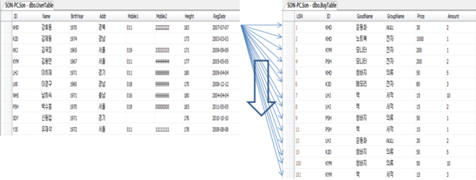

## 4.1 NL 조인

NL 조인은 인덱스를 이용한 조인이다.

## 4.1.1 기본 메커니즘

    - Nested Loops 조인(NL 조인)
    - 일반적으로 NL 조인은 Outer 와 Inner 양쪽 테이블 모두 인덱스를 이용합니다.
    - Outer 테이블은 사이즈가 크지 않거나 또는 Table Full Scan 을 해도 한번에 그치므로 인덱스를 사용하지 않을 수 있습니다.
    - 하지만 Inner 테이블을 Outer 루프를 읽는 건수만큼 반복되므로 인덱스를 반드시 사용해야 합니다.

## 4.1.2 NL 조인 실행계획 제어

## 4.1.3 NL 조인 수행 과정 분석

    - 한 레코드씩 순차적으로 진행된다는 사링이 중요하다
    -   1. 초기 컬럼 이 BETWEEN인 경우 비효율 없이 한 방에 스캔 합니다. 하지만 그만큼 테이블 랜덤 액세스가 발생하므로 사원 테이블이 아주 많은 양의 랜덤 액세스를 발생시킬 수 있으므로 경우에 따라 부서코드 컬럼을 인덱스에 추가하는 방안을 고려해 보자
    -   2. 조인 액세스 횟수가 많을수록 성능이 느려집니다. 조인액세스 횟수는 Outer 테이블인 사원을 읽고 필터링한 결과건수에 의해 결정됩니다.
            - 만약 부서코드조건을 만족하는 액세스가 3개이면 3번의 조인시도가 있고, 그 부서코드조건을 만족하는 레코드가 10만건이고 depth 3이면 30만건이 추가적으로 블록을 읽습니다.
        3. >= 이 사용되었는데 필터링 되는 비율이 높다면 애초에 인덱스에 최종주문금액 컬럼을 추가하는 방안도 고려합니다.
        4. 맨처음 액세스하는 사원 인덱스에서 얻은 결과 건수에 의해 전체 일량이 좌우됩니다.

## 올바른 조인 메소드 선택

    - OLTP 시스템에서 튜닝 시 일반적으로 NL 조인부터 고려합니다.
    - 성능이 느리다면 각 단계의 수행 일량을 분석해서 과도한 랜덤 액세스가 발생하는 지점을 먼저 찾습니다.
    - 조인 순서를 변경하거나 효과적인 다른 인덱스가 있는지 검토하여 변경하는 것도 고려합니다.
    - 여러가지 사안들을 고려해도 좋은 성능이 안나온다면 소트 머지 조인이나 해시 조인을 검토합니다.

## 4.1.5 NL 조인 특징 요약
    -   1. 랜덤 액세스 위주의 조인입니다
        - 레코드 하나를 읽기위해 블록을 통째로 읽는 랜덤 액세스 방식은 비효율이 존재합니다
        - 대량 데이터 조인시 불리합니다
    -   2. 한 레코드씩 순차적으로 진행합니다
        - 대량 데이터 처리 시 치명적인 한계가 있지만
        - **부분 범위 처리**가 가능한 상황에서는 아무리 큰 테이블을 조인하더라도 매우 빠른 응답 속들 낼 수 있습니다.
    - **따라서 OLTP 시스템에 적합한 조인 방식이다**

## 4.1.6 NL 조인 튜닝 실습
    -   1. 테이블 액세스가 지나치게 높다는 것은 테이블을 액세스 한 후 필터링 되는 비율이 높다는것이다. 이런 경우 인덱스에 테이블 필터 조건 컬럼을 추가하는 것을 고려해야합니다
    -   2. 테이블 액세스 이전의 인덱스 스캔 단계에서의 일량을 확인해야봐야 합니다
        - 인덱스에서 읽은 블록이 100여개이고 한블록에 평균 500개가 있다면 인덱스에서 3건을 얻기 위해 5만개의 레코드를 읽은 것이다. (현재 인덱스가 입사일자 + 부서코드 인데 입사일자가 >=이다 따라서 스캔량이 굉장히 많다) 이런 경우 부서코드+ 입사일자로 = 인 부서코드를 앞에 두는 것을 고려해야 합니다. 물론 다른 쿼리에 미치는 영량력을 고려해야 합니다. 
        3. 조인 시도 횟수는 많지만 실제 결과는 적을수 있습니다. 이런 경우 조인 순서를 변경을 고려할 수 있습니다. 그래도 효과가 없다면 소트머지조인과 해시 조인을 고려해야 합니다.
## 4.1.7 NL 조인 확장 메커니즘
    - NL 조인 성능을 높이기 위해 테이블 Prefetch, 배치 I/O 기능이 오라클에 존재합니다.
    - Prefetch : 인덱스를 이용해 테이블을 액세스하거나 디스크 I/O 가 필요해지면 곧 일게 될 블록까지 미리 읽어서 버퍼캐시에 적재됩니다
    - 배치 I/O : I/O Call 을 미뤘다가 일정량 쌓이면 한번에 처리 됩니다.

## 4.2 소트 머지 조인

## 4.2.1 SGA vs PGA

    SGA : 공유 메모리 영역으로 SGA에 캐시된 데이터는 여러 프로세스가 공유할 수 있습니다. 하지만 동시 액세스가 되지 않아 Lock 메커니즘인 래치가 존재합니다
    PGA : 각 오라클 서버 프로세스에 할당된 메모리 영역으로 프로세스에 종속적인 고유 데이터를 저장하는 용도로 사용됩니다. 할당받은 PGA 공간이 작아 데이터를 모두 저장할 수 없는 Temp 테이블스페이스를 이용합니다.
        - 다른 프로세스와 공유하지 않는 독립적인 메모리 공간으로 **래치 메커니즘이 불필요합니다.** 따라서 같은 양의 데이터를 읽더라도 SGA 버퍼캐시에서 읽을 때보다 훨씬 빠릅니다.

## 4.2.2 기본 메커니즘

    소트 머지 조인(Sort Merge Join)
    1. 소트 단계 : 양쪽 집합을 조인 컬럼 기준으로 정렬합니다.
    2. 머지 단계 : 정렬한 양쪽 집합을 서로 머지(Merge) 합니다

    SELECT /*+ ordered use_merge(c) */
       e.사원번호, e.사원명, e.입사일자
     , c.고객번호, c.고객명, c.전화번호, c.최종주문금액
  FROM 사원 e, 고객 c
 WHERE c.관리사원번호 = e.사원번호
   AND e.입사일자 >= ‘19960101’
   AND e.부서코드 = ‘Z123’
   AND c.최종주문금액 >= 2000

   - 위 SQL 은 힌트로 use_merge 를 적어 소트 머지 조인을 명시하였고, ordered 를 명시하여 FROM 절 순서대로 조인이 진행되도록 명시합니다.
   - 사원 테이블 기준으로 (ordered) 고객 테이블과 조인할 때 소트머지 조인 방식을 사요하라고 지시합니다

## 1번. 사원 테이블 정렬

SELECT 사원번호, 사원명, 입사일자
  FROM 사원
 WHERE 입사일자 >= ‘19960101’
   AND 부서코드 = ‘Z123’
 ORDER BY 사원번호

    - 현재 조인컬럼은 사원번호 입니다. 따라서 정렬 기준은 조인컬럼이 됩니다.
    - 사원 데이터를 사원번호로 정렬한 후 정렬 결과집합을 PGA 영역에 할당된 Sort Area에 저장합니다. 크키가 커 할당 불가능 한 경우 Temp 테이블스페이스에 저장합니다.

## 2번. 고객 테이블 정렬

SELECT 고객번호, 고객명, 전화번호, 최종주문일시, 관리사원번호
  FROM 고객
 WHERE 최종주문금액 >= 20000
 ORDER BY 관리사원번호

    - 조인 컬럼인 사원번호로 고객테이터를 읽어 정렬한다.
    - 정렬한 결과집합은 PGA 영역에 할당된 Sort Area 에 저장한다. 크기가 커 할당 불가능 한 경우 Temp 테이블스페이스에 저장한다.

## 3번. 조인

begin
    for outer in (select * from PGA_정렬된_사원)
    loop -- outer 루프
        for inner in (select * from PGA_정렬된_고객 where 관리사원번호 = outer.사원번호)
        loop -- inner 루프
            dbms_output.put_line( … );
        end loop;
    end loop;
end

    - PGA(또는 Temp)에 저장한 사원데이터를 스캔하면서 PGA(또는 Temp) 에 저장한 고객 테이터와 조인한다.
    - 3번은 NL 조인과 거의 동일하다

## 핵심

    - 사원데이터를 기준으로 고객 데이터를 매번 Full Scan 하지 않는다.
    - 조인 컬럼으로 2개의 테이블이 모두 정렬되어 있기 때문에 조인 대상 레코드가 시작되는 지점과 끝나는 지점을 바로 알 수 있다.
    - Sort Area 에 저장한 데이터 자체가 인덱스 역할 이므로 조인 컬럼에 인덱스가 없어도 사용할 수 있다.
    - 따라서 NL 조인이 대량 데이터 조인시 불리하지만 소트 머지는 유리한 측면이 존재한다.

## 4.2.3 소트 머지 조인이 빠른 이유

    - NL 조인은 인덱스를 이용한 조인 방식입니다.
        - 조인 과정에서 액세스하는 모든 블록은 랜덤 액세스 방식으로 매번 DB 버퍼캐시를 경유해서 읽습니다.
        - 즉 인덱스든 테이블이든, 읽은 모든 블록에 래치 획득 및 캐시버퍼 체인 스캔 과정을 거칩니다.
        - 버퍼캐시에 없으면 매번 디스크에서 읽어옵니다.
    - 소트 머지 조인은 도인 대상 집합을 일괄적으로 읽어 PGA(또는 Temp) 에 저장한 후 조인합니다.
        -  PGA 는 독립적 공간으로 래치 획득 과정이 없습니다.
        - 단 소트 머지 조인도 양쪽 테이블에서 조인 대상 집합을 읽을 때는 DB 버퍼 캐시를 경유하고 인덱스를 이용하기도 합니다.
## 4.2.4 소트 머지 조인의 주용도

    - 해시조인이 더 빠르지만 소트 머지도 여전히 유용하게 쓰입니다.
    - 주 사용 상황은 다음과 같습니다
        - 조인 조건식이 등치 조건이 아닌 대량 데이터 조인
        - 조인 조건식이 아예 없는 조인(Croos Join, 카테시안 곱)

## Cross Join , 카테시안 곱

    - CROSS JOIN은 상호 조인이라고도 불리며 , 한 쪽 테이블의 모든 행들과 다른 테이블의 모든 행을 조인시키는 기능을 합니다.
    - 그래서 CROSS JOIN의 결과 개수는 두 테이블의 행의 개수를 곱한 개수가 됩니다.
    
    - UserTable의 첫 행이 BuyTable의 모든 행과 조인되고, 그것을 UserTable의 모든 행이 반복하는 것입니다.
    - 그러므로 UserTable의 행 갯수 10 과 BuyTable의 행 갯수 14 가 곱해져서 총 개 140 개의 결과가 된다.
    - 이러한 CROSS JOIN을 카티션 곱 (Cartesian Product)라고도 한다.
    - CROSS JOIN은 대개 테스트로 사용할 대용량의 테이블을 생성할 경우에 사용된다.
    - 예를 들어, 각 5 만건과 7 만건의 테이블을 CROSS JOIN 하면 35억건의 데이터를 생성시킬 수 있다.

## 4.2.5 소트 머지 조인 제어하기

    - 아래 실행계획은 양쪽 테이블을 각각 소트한 후 , 위쪽 사원 테이블 기준으로 알쪽 고객 테이블과 머지조인한다 로 해석하면 된다.(소트할 대상을 찾기 위해 테이블 액세스 시 인덱스를 사용하기도 한다.)

    -- 소트 후, 위쪽 테이블 기준으로 아래쪽 테이블을 머지 조인
    -- 소트할 때 인덱스를 사용해서 인덱스로 표현된 것 뿐이지, 인덱스 없이 스캔했다면 TABLE FULL SCAN으로 나올 수 도 있음
    MERGE JOIN
        SORT (JOIN)
            TABLE ACCESS (BY INDEX ROWID) OF '사원' TABLE
                INDEX (RAGNE SCAN) OF '사원_X1' (INDEX)
        SORT (JOIN)
            TABLE ACCESS (BY INDEX ROWID) OF '고객' TABLE
                INDEX (RAGNE SCAN) OF '고객_X1' (INDEX)

## 4.3 해시 조인

    - NL 조인은 인덱스를 이용한 조인으로 인덱스 구성에 따른 성능차이가 심하고 , 랜덤 I/O로 인해 대량 데이터 처리에 불리하고 , 버퍼캐시 히트율에 따라 성능이 들쭉날쭉합니다
    - 소트 머지 조인과 해시 조인은 조인 과정에 인덱스를 사용하지 않아 대량 데이터 조인시 훨씬 빠르고 일정한 성능을 보입니다.
    - 소트 머지 조인은 양쪽 테이블을 정렬하는 부담이 있지만 해시 조인은 한쪽만 해시 테이블을 만들기 때문에 그런 부담이 없습니다.

## 4.3.1 기본 메커니즘

    해시 조인(Hash Join)
    1. Build 단계 : 작은 쪽 테이블(Build Input)을 읽어 해시 테이블(해시 맵)을 생성합니다.
    2. Probe 단계 : 큰 쪽 테이블(Probe Input)을 읽어 해시 테이블을 탐색하면서 조인합니다.

        - 해시 조인은 use_hash 힌트로 유도합니다.

        -- use_hash : 해시 조인을 사용하라는 의미이다.
        -- ordered를 명시하였으므로 먼저 읽은 사원 테이블을 기준으로 해시 맵을 생성
        -- swap_join_inputs(e) 힌트를 사용하면 명시한 테이블 기준으로 해시 맵을 생성
        SELECT /* ordered use_hash(c) */
            ...
        FROM 사원 e, 고객 c
        WHERE c.관리자사원번호 = e.사원번호
        AND e.입사일자 >= '19960101'
        AND e.부서코드 >= 'Z123'
        AND c.최종주문금액 >= 20000

## 1. Build 단계 : 작은 쪽 테이블(Build Input)을 기준으로 조인 컬럼을 Key로 하여 해시 맵을 생성합니다. 단 아래는 Ordered를 명시하였으므로 먼저 읽은 사원 테이블 기준으로 해시 맵을 생성합니다.

    - 사원테이블을 읽어 해시 테이블을 생성합니다.
    - 이때 조인 컬럼인 사원번호를 해시 테이블 키 값을 사용합니다.
    - 사원 번호를 해시함수 키값으로 해시 체인을 찾고, 그 해시 체인에 데이터를 연결합니다.
    - 해시 테이블은 PGA 영역에 할당된 Hash Area 에 저장합니다.
    - 해시 테이블이 너무 큰 경우 Temp 테이블스페이스에 저장합니다.

    -- 사원 테이블을 읽어 해시 맵을 생성
    -- 조인 컬럼인 사원번호를 해시 맵의 키 값으로 사용
    SELECT
        ...
    FROM 사원
    WHERE 입사일자 >= '19960101'
    AND 부서코드 >= 'Z123'

## 2. Probe 단계 : 큰 쪽 테이블(Probe Input)을 읽어 조인 컬럼을 가지고 해시 맵을 탐색 하면서 조인

    - 고객 데이터를 하나씩 읽어 앞에서 만든 해시 테이블을 탐색합니다.
    - 관리사원번호(조인컬럼)을 해시 함수에 입력해 반환된 값으로 해시 체인을 찾고 스캔하여 같은 사원번호를 찾습니다. 찾으면 조인 성공, 없으면 실패입니다.

    -- 고객 테이블을 하나씩 읽어 앞서 생성한 해시 맵을 탐색
    -- 관리자사원번호를 해시 함수에 입력
    SELECT
        ...
    FROM 고객
    WHERE 최종주문금액 >= 20000

## 4.3.2 해시 조인이 빠른 이유
    - 조인 방식은 NL 조인과 거의 동일합니다
    - PGA 영역을 사용하고, 해시 조인은 래치 획득 과정이 없어 NL 보다 빠르다
    - 해시 조인도 Build Input 과 Probe Input 각 테이블을 읽을 때 DB 버퍼캐시를 경유하고 인덱스를 이용하기도 합니다.

## 소트 머지 조인 vs 해시 조인

    - 소트 머지 조인은 양쪽 집합을 정렬해야 합니다.
        - 둘중 어느 하나가 중대형이라면 Temp 테이블스페이스, 즉 디스크에 쓰는 작업을 수반합니다.
    - 해시 조인은 어느 한쪽을 읽어 해시 맵을 만듭니다.
        - 둘 중 작은 집합을 해시 맵 Build Input 으로 선택하므로 두 집합 모두 Temp로 갈 정도로 크지 않는 한 Temp 즉 디스크 작업은 없습니다.
    - 따라서 인메모리(In-Memory) 해시 조인이 가장 효과적입니다.
    - 설령 Temp 를 써도 대량 데이터 조인시 일반적으로 해시 조인이 가장 빠릅니다.

## 4.3.3 대용량 Build Input 처리
    - 두 테이블 모두 대용량으로 인메모리 해시조인이 불가능한 경우 분할 정복 방식으로 DBMS 는 해시조인 처리합니다.

## 1. 파티션 단계
    - 조인하는 양쪽 집합의 조인 컬럼에 해시 함수를 적용하고 반환된 해시 값에 따라 동적을 파티셔닝합니다.
    - 파티셔닝 된 양쪽 집합을 디스크 Temp 공간에 저장하므로 인메모리 해시 조인보다는 성능이 많이 떨어집니다.

## 2. 조인 단계

    - 각 파티션 짝에 대해 조인이 수행됩니다.
    - 이때 각각에 대한 Build Input 과 Prove Input 은 독립적으로 결정됩니다.
        - 즉 작은 쪽을 Build input으로 선택하고 진행됩니다.

## 4.3.4 해시 조인 실행계획 제어

    - 위쪽(HASH JoIN 바로 아래) 사우너 데이터(Build Input) 로 해시 테이블을 생성한 후 , 아래쪽 고객 테이블(Probe Input)에서 읽은 조인 키값으로 해시 테이블을 탐색하면서 조인합니다 고 해석하면 됩니다.(위쪽 Build Input과 아래쪽 Probe Input을 읽을때 인덱스를 이용한 사실도 실행계획에서 확인가능합니다 물론 Table Full Scan 도 가능합니다)

    -- 위쪽 테이블 기준으로 해시 맵을 생성한 후, 아래쪽 테이블에서 읽은 조인 키값으로 해시 맵 탐색
    -- 소트할 때 인덱스를 사용해서 인덱스로 표현된 것 뿐이지, 인덱스 없이 스캔했다면 TABLE FULL SCAN으로 나올 수 도 있음
    HASH JOIN
        TABLE ACCESS (BY INDEX ROWID) OF '사원' TABLE
            INDEX (RAGNE SCAN) OF '사원_X1' (INDEX)
        TABLE ACCESS (BY INDEX ROWID) OF '고객' TABLE
            INDEX (RAGNE SCAN) OF '고객_X1' (INDEX)

    - use_hash 힌트만 사용시 옵티마이저가 카디널리티가 작은 테이블을 일반적으로 선택
    - 직접 선택하고 싶은 경우 leading 이나 ordered 힌트를 사용하면 된다.

## 세 개 이상 테이블 해시 조인
A,B,C 조인시 A<->B<->C 방식으로 조인하면 된다.

    - leading 힌트로 지정시 leading 의 첫번째 파라미터로 지정한 테이블은 무조건 BUild Input 으로 선택된다.
    - 가능한 패턴은 2가지이다.
    - 변경 하고 싶은 경우 swap_join_inputs 힌트를 사용하라
    - 조인한 결과집합을 Build Input 으로 사용하고 싶은 경우 no_swap_join_inputs 힌트를 사용하라

## 4.3.5 조인 메소드 선택 기준

    - 반드시 선택에는 이유와 근거를 가지고 해야 합니다.

    1. 소량 데이터 조인 :  NL조인
    2. 대량 데이터 조인 : 해시 조인
    3. 대량 데이터 조인인데 해시 조인으로 처리할 수 없을 때, 즉 조인 조건식이 등치 조건이 아닐때 (조인 조건식이 아예 없는 카테시안 곱 포함) : 소트 머지 조인

    - 수행 빈도가 매우 높은 쿼리에 대해

    1. (최적화된) NL 조인과 해시 조인 성능이 같은 경우 : NL 조인
    2. 해시 조인이 약간 더 빨라도 : NL조인
    3. NL 조인보다 해시 조인이 매우 빠른 경우 : 해시 조인

    - NL 조인에 사용하는 인덱스는 영구적으로 유지하면서 다양한 쿼리를 위해 공유 및 재사용하는 자료구조입니다.
    - 해시 테이블은 단 하나의 쿼리를 위해 생성하고 조인이 끝나면 곧바로 소멸하는 자료구조 입니다.
    - 따라서 수행시간이 짧으면서 수행빈도가 매우 높은 쿼리(OLTP) 를 해시 조인으로 처리하면 CPU와 메모리 사용률이 증가하면서 여러 해치 경합이 발생가능합니다.
    - 다음 조건시 해시 조인을 사용해라
        1. 수행 빈도가 낮고
        2. 쿼리 수행 시간이 오래 걸리때
        3. 대량 데이터 조인할 때
        - 이 세가지 조건은 배치프로그램, DW, OLAP 성 쿼리의 특징이다.

